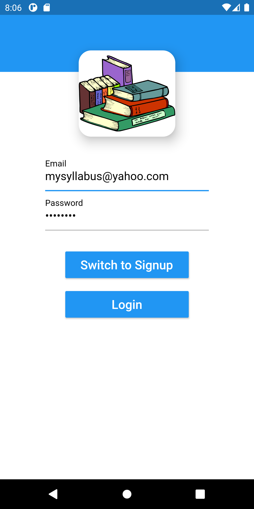
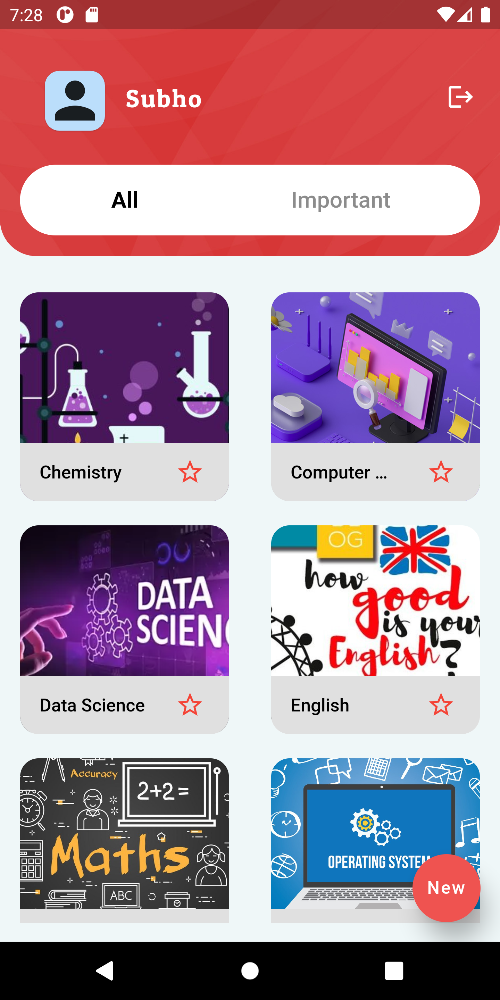
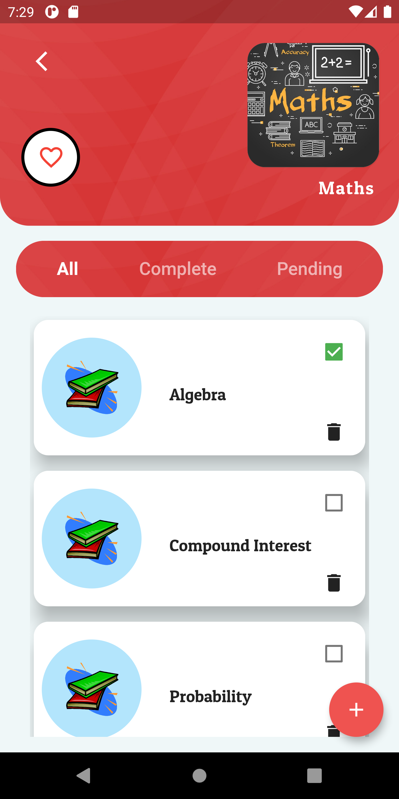
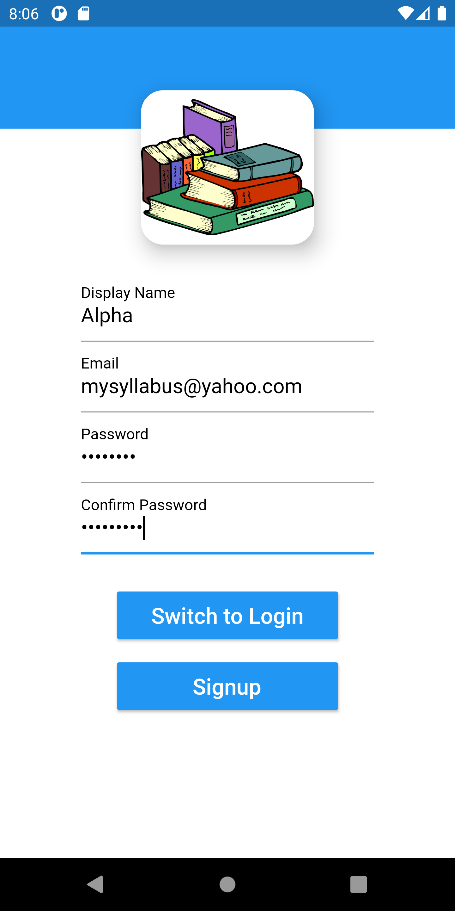

## Syllabus App
| Login | Homepage | Subtopic Page | Sign Up
|-----------------------------------------------------------------------------------------------------------------------------|-------------------------------------------------------------------------------------------------------------------------------|----------------------------------------------------------------------------------------------------------------------|--------------------------------------------------------------------------------------------------------------------------------

| |  |  | 

# Show some :heart: and star the repo to support the project.

## Contribute
1. Fork the the project
2. Make required changes and commit (git commit -am 'Add some feature')
3. Push to the main branch
4. Create new Pull Request
